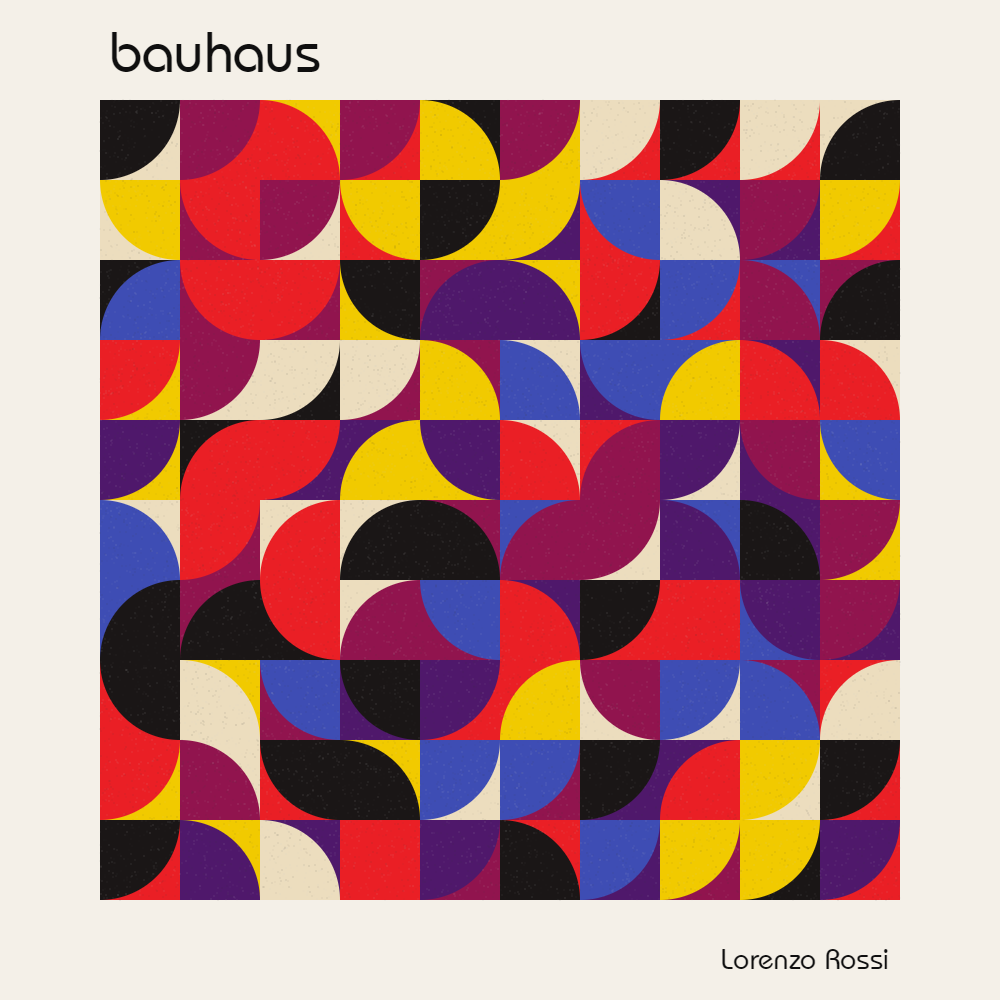
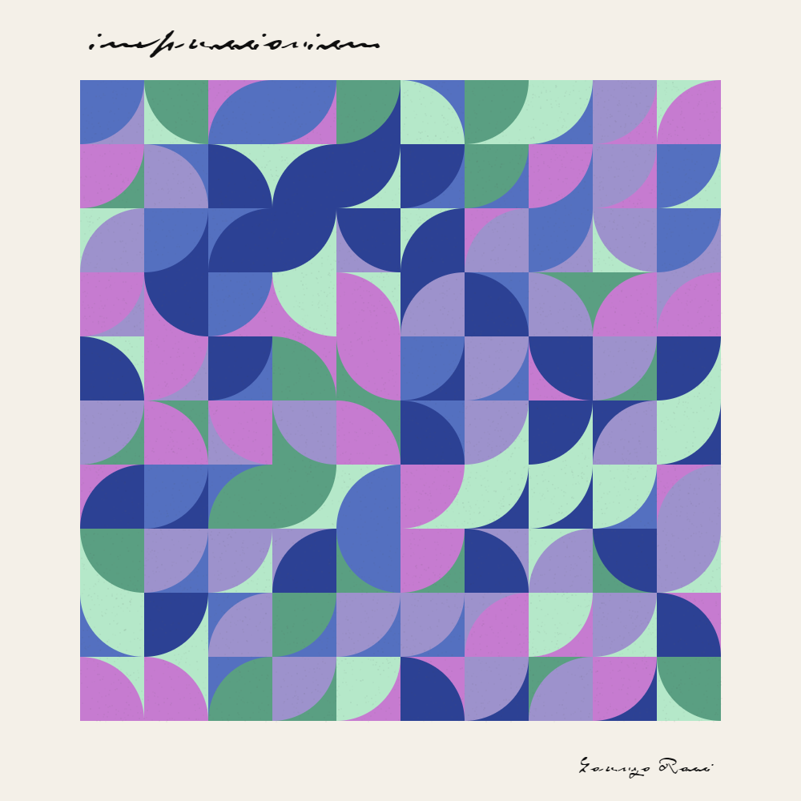
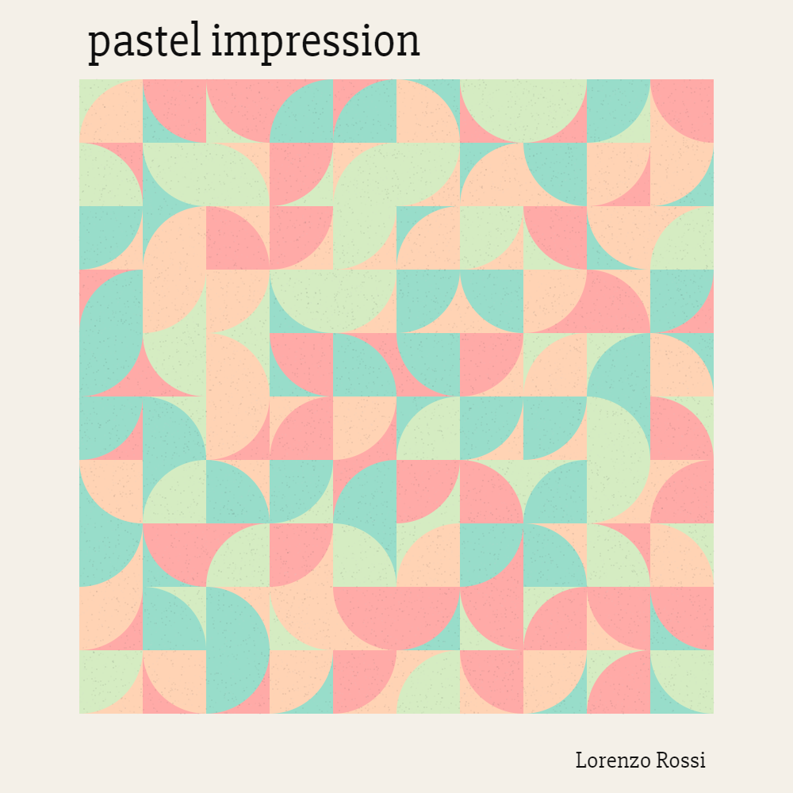
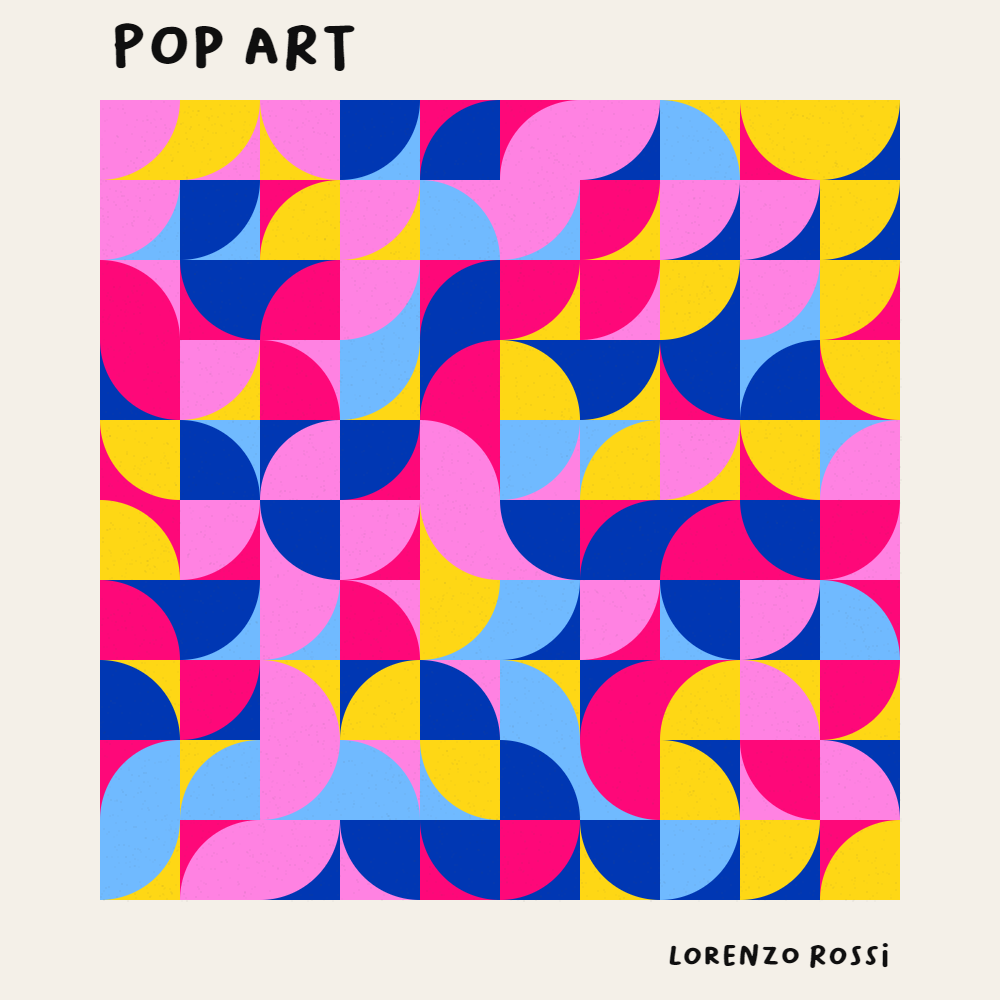
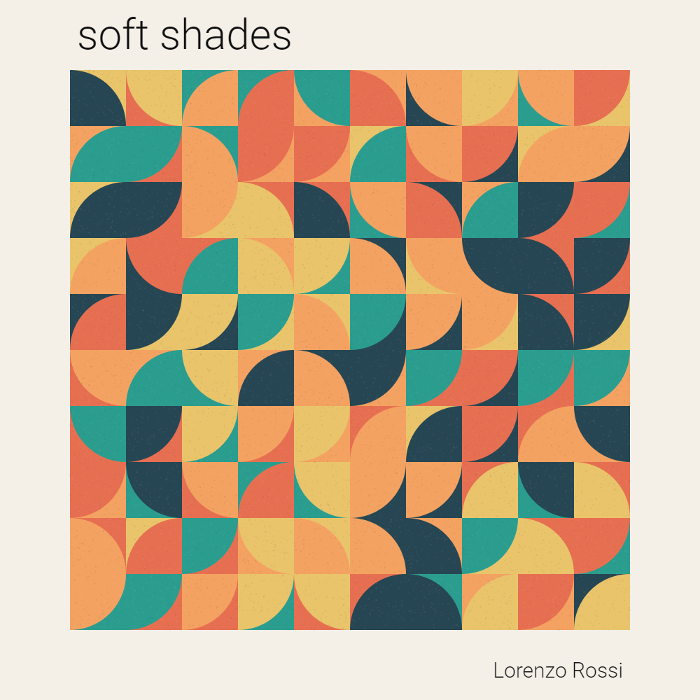
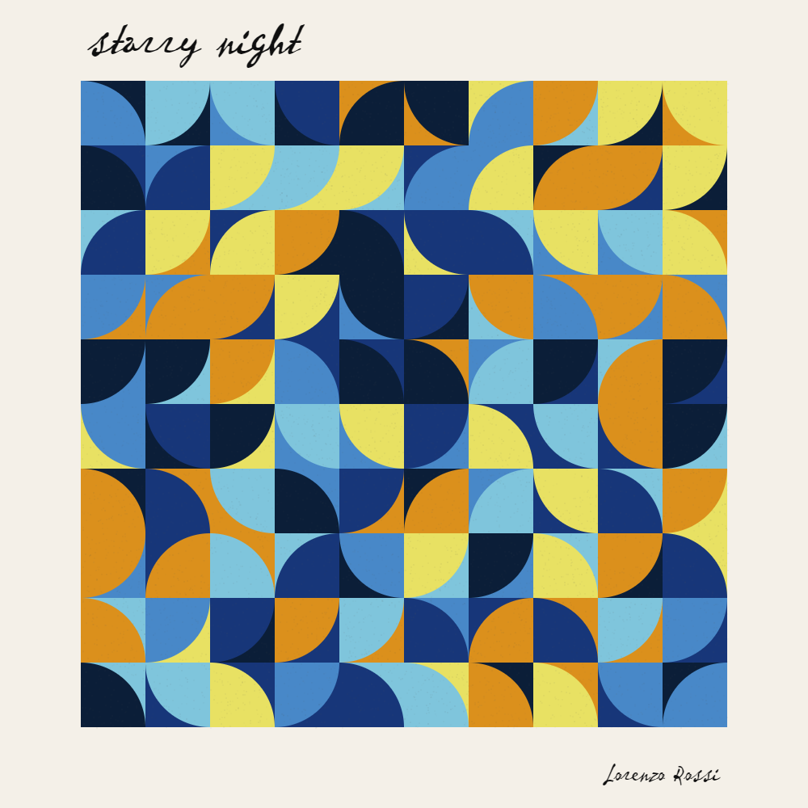

# Circle tiling

There's really not much I can say about this. I like tiling, I like art, I like coding.

Wouldn't you say?

If I were an artist, I would call this *Study on circular plane tiling*

## Try it here [lorenzoros.si/tiling-circles](https://www.lorenzoros.si/tiling-circles)

View more of my work on my [website](https://www.lorenzoros.si) or on my [Instagram profile](https://www.instagram.com/lorossi97)

## Output images

## Credits

This project is distributed under Attribution 4.0 International (CC BY 4.0) license.
